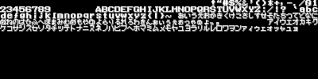

# go-nes-sprites2png
export a sprites nes file to png by golang

## Screenshot



## Usage

```golang
go run main.go -r assets/hello_world.nes -o sprite.png -w 400 -h 100
```

## Testing

```rust
go test -v ./...
```